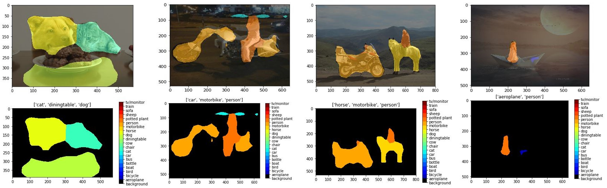

# Fully Convolutional Networks for Image Segmentation

In this report, J. Long's method [1] was implemented in order to understand how Fully Convolutional Networks can be used for semantic segmentation tasks. 

## Network Architecture

## Pascal VOC

## FCN on Pascal VOC

__________________
# Results and Observations

1. Train 32s from vgg weights (finetuning).

2. Train 32s from scratch (**No** finetuninng). 

3. Train 16s from 32s weights.

4. Train 16s from vgg weights.

5. Train 16s from scratch.

## References
[1] J. Long, E. Shelhamer, and T. Darrell.  Fully convolutional networks for semantic segmentation.  In Proceedings of the IEEE  conference  on  computer  vision  and  pattern  recognition, pages 3431–3440, 2015.
